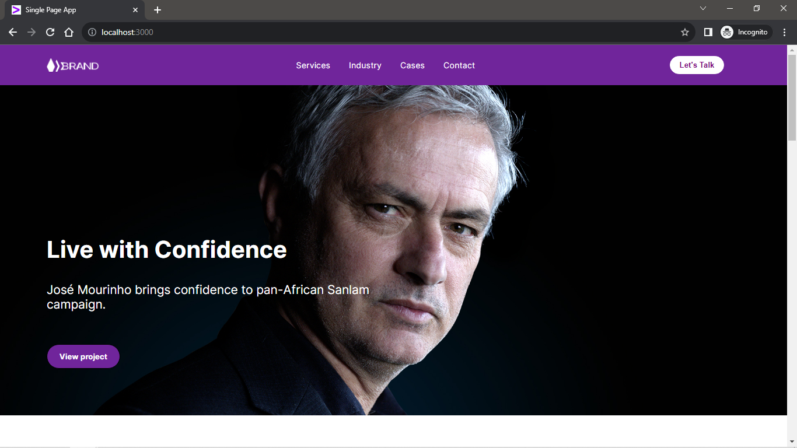

# Front End Developer Challenge

]

## Installation Guide

**Prerequisites:**

1. Ensure that you have Node.js and npm (Node Package Manager) installed on your system. You can download and install them from [https://nodejs.org/](https://nodejs.org/).

**Installation Steps:**

1. Clone the repository to your local machine using Git:

   ```shell
   git clone <repository-url>
2. Open the cloned repository using command: 
   ```shell
   cd <repository-url>
3. Install necessary packages required to start project, use command: 
   ```shell
   npm install
4. Start the project by running: 
   ```shell
   npm start
## Requirements
The following requirements were set for this project:
1. Code a single page that matches the figma design provided using React.

## Technologies Used

- **React:** A popular JavaScript library for building user interfaces.
- **Inter:** For styling fonts in the project.
- **CSS:** Custom styling for the overall appearance.

## Project Structure
The project consists of 5 main components:

1. **NavBar:**  Renders a navigation bar with a logo, navigation links, and a call-to-action button. It is styled using CSS classes and contains external links that open in a new tab.

2. **WhatWeDo:** Displays a section with a title and description about the services offered. It dynamically renders a list of items using data from a JSON file (imported as `data`) to showcase service titles, descriptions, and associated logos. The items are mapped and displayed with their respective content. 

3. **TrustedBrands:** Displays a section featuring a title and statement, "Trusted by leading Brands," and showcases a list of brand logos. The logos are loaded from a JSON file named `brands` and dynamically rendered.

4. **CaseStudies:** fetches data from an API link using `axios`, then fixes image URLs using a helper function, and displays a section titled "Case Studies." It dynamically renders a list of case study items, each consisting of an image, title, and description. The images are loaded from the API response, and the data is displayed within the "horizontal-images" section. If no data is available, it returns `Loading images...`.

5. **FooterInfo:** It represents the footer section of a web page. It includes contact information, service links (such as Terms of Service and Privacy Policy), social media links, work-related links, creative links, and a section for exploring open jobs.